# DOSW_BITACORA
Bitácora Pokémon  donde cada entrenador registrará los resultados de sus investigaciones utilizando Java, Streams y  Expresiones Lambda. 

# SEMANA No 1 — DOSW Manejo de Streams

## Datos personales:
- **Nombre y Apellido:** jhonatan David Madero Riaño
- **Código de Estudiante:** 1000097206
- **Curso:** DOSW Intersemestral

---

### Ejercicio 1 — Numeros pares mayores a diez

Dada una lista de numeros enteros, obtener una nueva lista solo con los números pares mayores a 10.

**Código implementado:**
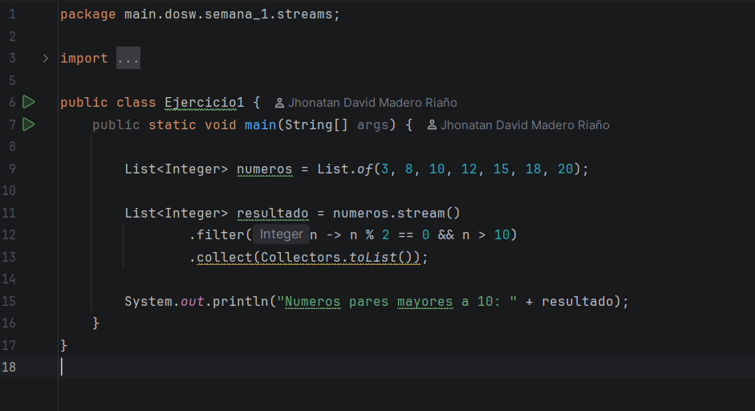

**Captura de ejecución:** 
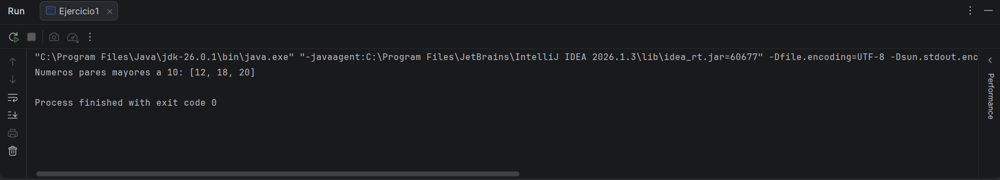

**Explicación:** Se usa `filter()` para conservar solo los números que cumplan dos condiciones: que sean pares (`n % 2 == 0`) y mayores a 10 (`n > 10`).

---

### Ejercicio 2 — Cantidad de palabras con mas de 4 caracteres

Dada una lista de palabras, filtrar las que tengan más de 4 caracteres, convertirlas en mayúsculas, ordenarlas alfabéticamente y contar el total.

**Código implementado:**
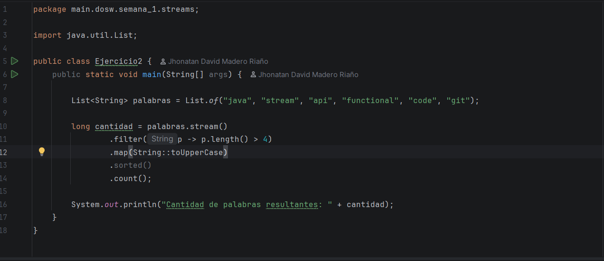

**Captura de ejecución:** 
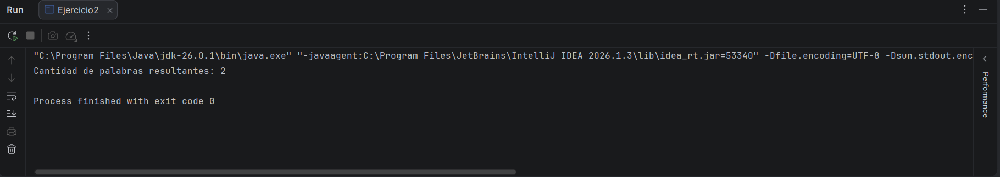

**Explicación:** Se encadenan `filter()` para palabras largas, `map()` para mayúsculas, `sorted()` para ordenar y `count()` para obtener el total.

---

### Ejercicio 3 — Obtener nombres de los usuarios

Dada una lista de usuarios con atributos id, name, age y active, filtrar solo los activos y obtener sus nombres en mayúscula ordenados alfabéticamente.

**Código implementado:**
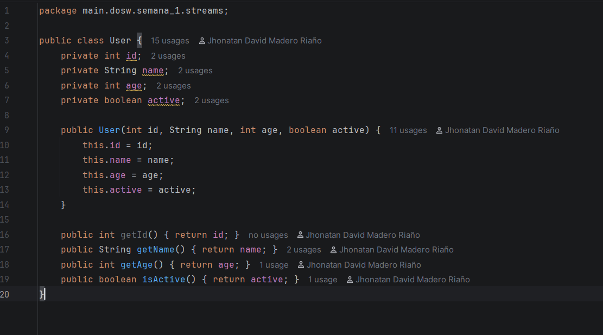
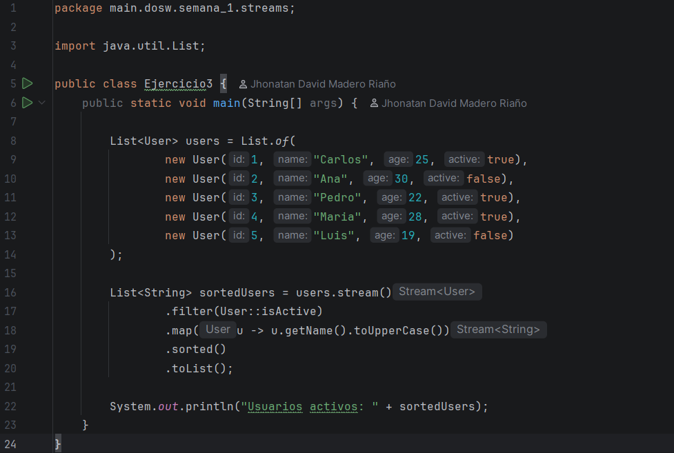

**Captura de ejecución:** 
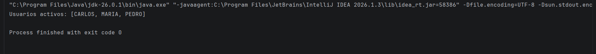

**Explicación:** Se usa `filter()` para quedarse con usuarios activos, `map()` para extraer el nombre en mayúsculas y `sorted()` para ordenarlos alfabéticamente.

---

### Ejercicio 4 — Personas mayores de edad

Dado un listado de usuarios, filtrar las personas mayores de edad y obtener sus nombres.

**Código implementado:**
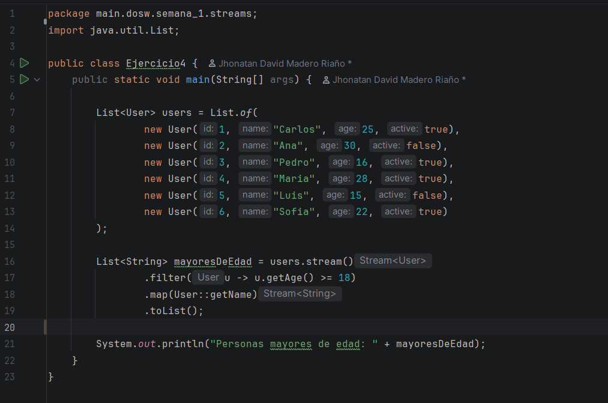

**Captura de ejecución:** 
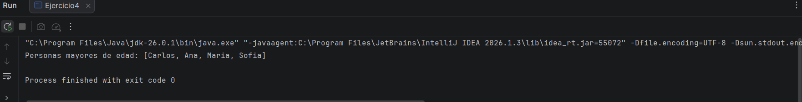

**Explicación:** Se usa `filter()` para conservar solo los usuarios con edad mayor o igual a 18 y `map()` para extraer únicamente sus nombres.

---

### Ejercicio 5 — Transacciones bancarias

Dada una lista de transacciones bancarias, usar `peek()` para ver cada transacción procesada y verificar si existe al menos una no aprobada.

**Código implementado:**
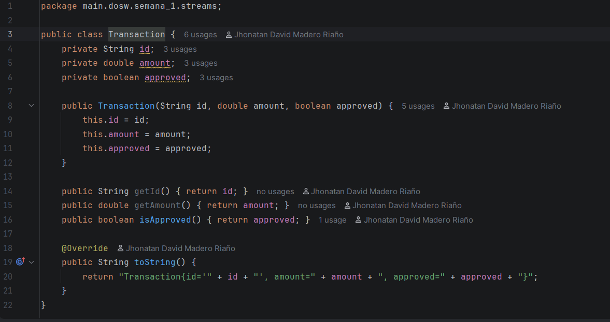
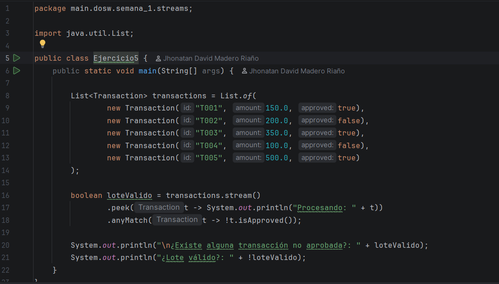

**Captura de ejecución:** 
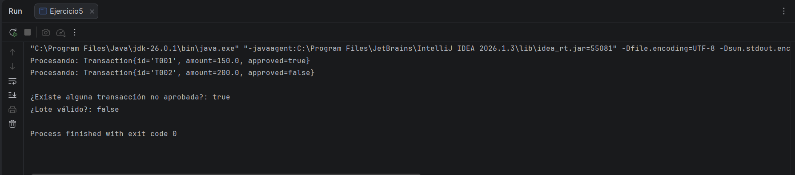

**Explicación:** Se usa `peek()` para imprimir cada transacción mientras se procesa y `anyMatch()` para verificar si al menos una no está aprobada. El lote es válido solo si todas están aprobadas.